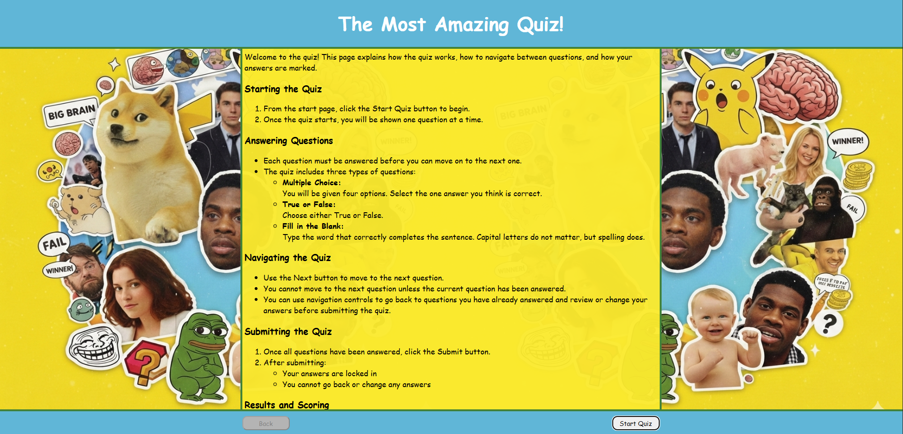
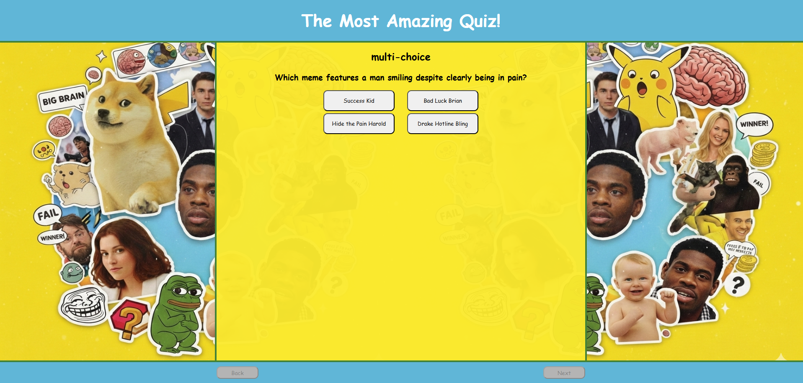
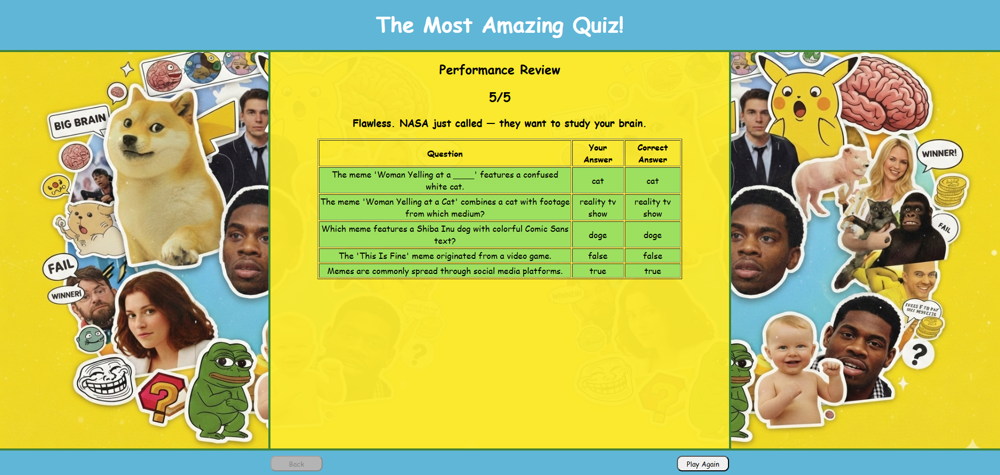
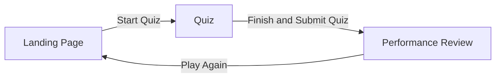

# The Most Amazing Quiz! Application

## Project Overview
This app is a quiz based around the theme of Memes. It is a Web based SPA (Single-Page-Application). Users can navigate through a quiz, answering each question, and then once the quiz is submitted, they can see how they performed on the quiz.

## Purpose
* This application was created to bring joy in to peoples life, and to bring people together over the love of Memes.
* A lot of people in this world have the big sad, and hopefully a fun quiz would brighten their day.
* This application was created for a project as part of my study.

## Value to Users
* Users can gain happiness by taking this quiz
* Users can challenge their friends to see who is the most powerful Meme Lord.
* Users will appreciate the performance review feature as it allows them to:
  * See how well they did.
  * See where they can improve.

## Features

### Landing Page

* The Landing Page consists of the **Quiz Title**, a **How-to** section, and a **Start Quiz** Button.
* The Landing Page allows users to see what Quiz App they are using, read how to complete the Quiz, and to start the quiz.

### Quiz Component

* The Quiz component consists of a label for the type of question, the **question** it self, and a method of answering each type of question, and a **Next** and **Back** button.
* The question types that are supported are:
  * Multi-choice (pictured above).
  * True or false.
  * Fill in the blank.
* The Next Button can be used to navigate to the next question once current question has been answered.
* The Back button can be used to navigate back to any previous question to change the answer.
* The Quiz component provides an intuitive environment to answer questions.
  

### Performance Review

The Performance Review consists of: 
* A fraction to show how many correct answers out of total questions.
* A funny and encouraging message to the user, so they will want to play again. 
* A color coded table listing all the questions and answers, so users know where they can improve.
* A **Play Again** button that when pressed will take users back to the Landing Page.

## User Flow

* Key rules 
  * Users must answer questions before continuing
  * Submission locks answers
  * while in the quiz, users can freely move back and fourth through the questions

## Responsiveness
* The layout has a max width so the content isn't stretched out on wide screens.
* When the view port is narrower than the max width, then the content automatically adjusts to the width of the screen. 
* A grid template was used with the answer buttons to make the layout switch from 2 columns to one column when the view port width becomes two narrow.
* Supported device types 
  * desktop
  * tablet
  * mobile

## Technologies Used
* Programming languages used
  * JavaScript
  * HTML
  * CSS
* Version control or tooling
  * Github

## Deployment Procedure
* To run locally: open the index.html file with any browser.
* To deploy using Github pages: [Github Pages Quickstart](https://docs.github.com/en/pages/quickstart).  

<!-- Written with the help of Chat GPT -->
## Testing
The application was tested using a combination of manual functional testing, responsive layout testing, and user playtesting to ensure reliability, usability, and correctness.

### Functional Testing
* Manual testing was conducted to verify all core functionality of the quiz workflow.
* This included:
  * Starting and restarting the quiz
  * Navigating between questions
  * Enforcing answer selection before progressing
  * Preventing navigation changes after quiz submission
  * Correct evaluation of user answers against expected answers
* All question types (multiple choice, true/false, and fill-in-the-blank) were tested to confirm correct behavior and validation.

### Responsive and Layout Testing
* The user interface was tested across multiple screen sizes to ensure responsive behavior.
* Layouts were verified on:
  * Desktop screen sizes
  * Mobile-sized viewports
* Responsive elements such as button layouts and grid-based components were tested to confirm they adapt correctly to available screen width and remain usable on smaller devices.

### Browser Compatibility Testing
* Tested across multiple modern web browsers to ensure consistent behavior and rendering.
* Browsers tested include:
  * Google Chrome
  * Mozilla Firefox
  * Microsoft Edge
* Core functionality and layout were verified to behave consistently across all tested browsers.

### User Playtesting
* The application was playtested by multiple users to assess usability and clarity.
* Feedback was gathered on:
  * Ease of navigation
  * Overall user experience
* This feedback was used to identify minor usability improvements and confirm that the quiz flow was intuitive for first-time users.

## Features not implemented
* Choice of quiz theme
* Choice of quiz length

## Potential improvements
* Could come up with a better name

## Author
* Samuel Dalmon
* Project 1 for Full Stack Development course
* The Learning People

<!-- Written by Chat GPT -->
## License / Disclaimer 
This project was created for educational purposes as part of a course assessment.

The application is intended for non-commercial use only and is not licensed for production or commercial deployment.

All content within the application, including quiz questions and assets, is used solely for learning and demonstration purposes. Any resemblance to copyrighted material is incidental, and no ownership of third-party content is claimed.