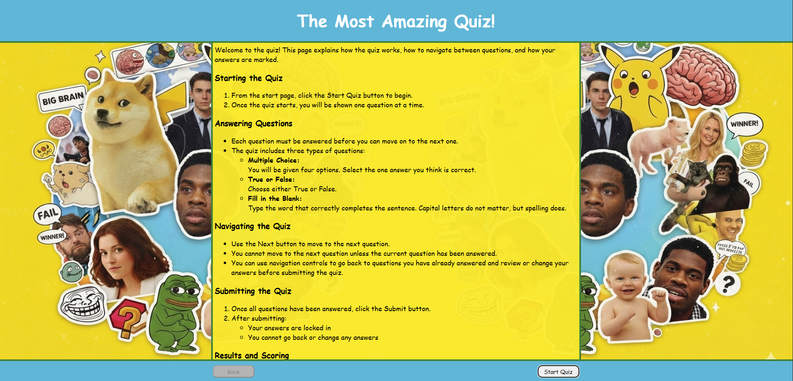
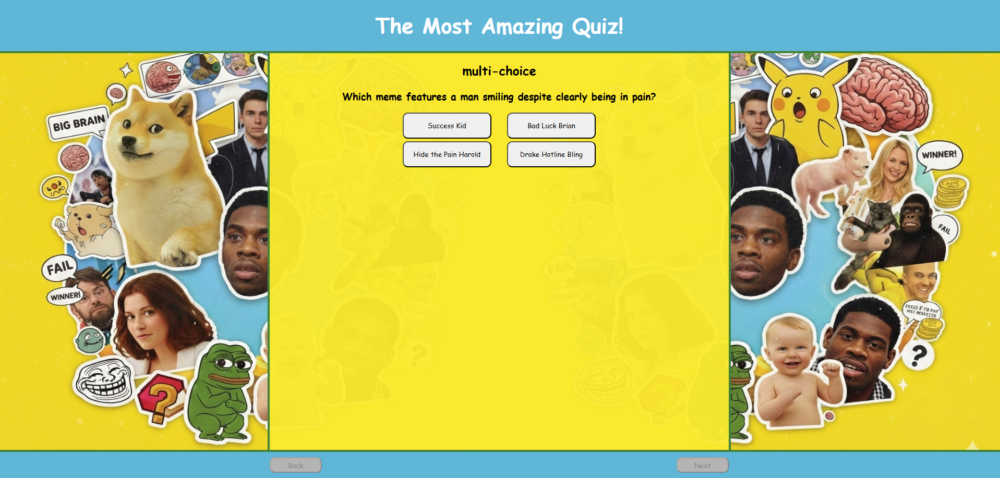
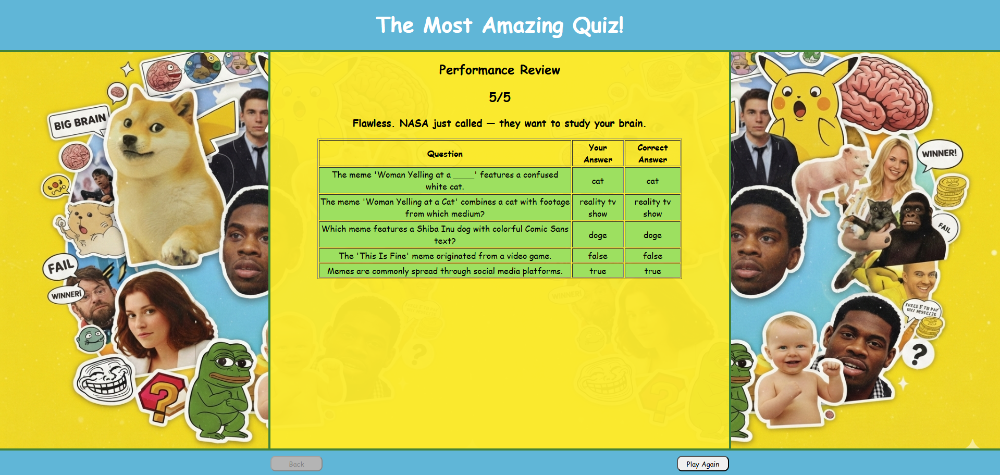
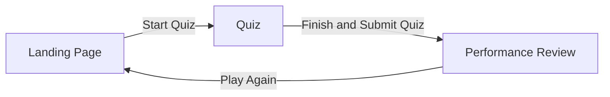
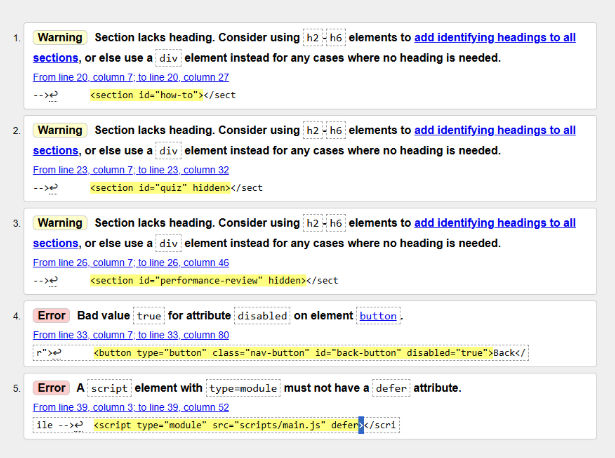
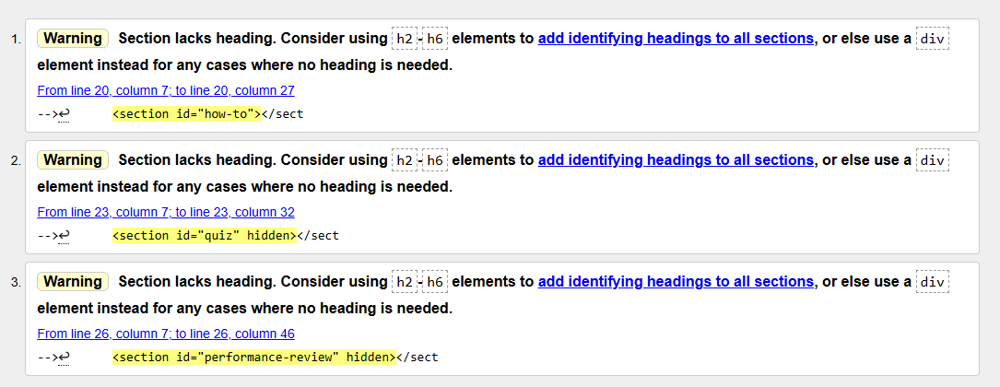
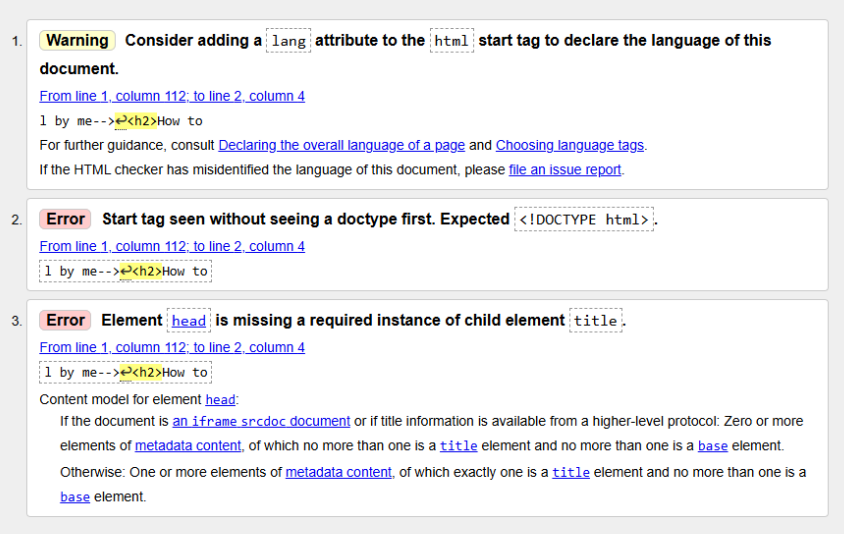
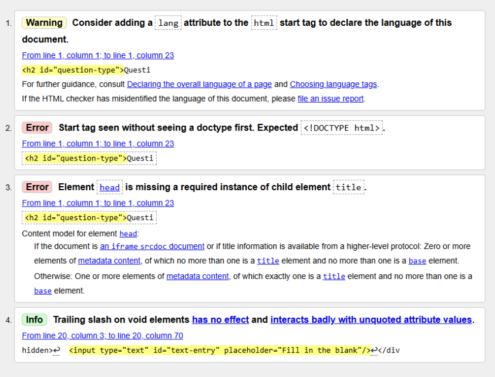
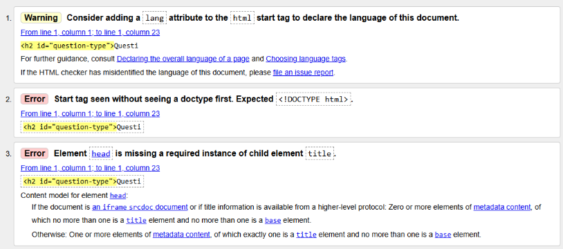
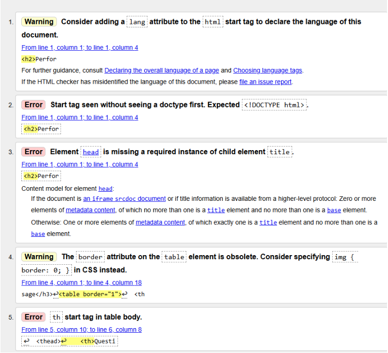

# The Most Amazing Quiz! Application

## Project Overview
This app is a quiz based around the theme of Memes. It is a Web based SPA (Single-Page-Application). Users can navigate through a quiz, answering each question, and then once the quiz is submitted, they can see how they performed on the quiz.

## Purpose
* This application was created to bring joy in to peoples life, and to bring people together over the love of Memes.
* A lot of people in this world have the big sad, and hopefully a fun quiz would brighten their day.
* This application was created for a project as part of my study.

## Value to Users
* Users can gain happiness by taking this quiz
* Users can challenge their friends to see who is the most powerful Meme Lord.
* Users will appreciate the performance review feature as it allows them to:
  * See how well they did.
  * See where they can improve.

## Features

### Landing Page

* The Landing Page consists of the **Quiz Title**, a **How-to** section, and a **Start Quiz** Button.
* The Landing Page allows users to see what Quiz App they are using, read how to start the quiz, answer the questions, and complete the quiz.

---

### Quiz Component

* The Quiz component consists of a label for the type of question, the **question** it self, and a method of answering each type of question, and a **Next** and **Back** button.
* The question types that are supported are:
  * Multi-choice (pictured above).
  * True or false.
  * Fill in the blank.
* The **Next** Button can be used to navigate to the next question once current question has been answered.
* The **Back** button can be used to navigate back to any previous question to change the answer.
* The Quiz component provides an intuitive environment to answer questions.
  
---

### Performance Review


The Performance Review consists of: 
* A fraction to show how many correct answers out of total questions.
* A funny and encouraging message to the user, so they will want to play again. 
* A color coded table listing all the questions and answers, so users know where they can improve.
* A **Play Again** button that when pressed will take users back to the Landing Page.

---

## User Flow

```mermaid
  flowchart LR
    landingPage["Landing Page"]
    performanceReview["Performance Review"]
    quiz["Quiz"]
    
    quiz -- Finish and Submit Quiz --> performanceReview
    performanceReview -- Play Again --> landingPage
    landingPage -- Start Quiz --> quiz
    
```
* Key rules 
  * Users must answer questions before continuing
  * Submission locks answers
  * While in the quiz, users can freely move back and fourth through the questions

## Responsiveness
* The layout has a max width so the content isn't stretched out on wide screens.
* When the view port is narrower than the max width, then the content automatically adjusts to the width of the screen. 
* A grid template was used with the answer buttons to make the layout switch from 2 columns to one column when the view port width becomes two narrow.
* Supported device types 
  * Desktop
  * Tablet
  * Mobile

## Technologies Used
* Programming languages used
  * JavaScript
  * HTML
  * CSS
* Version control or tooling
  * Github

## Deployment Procedure
* To run locally, follow the instructions located here: [Set up local testing server](https://developer.mozilla.org/en-US/docs/Learn_web_development/Howto/Tools_and_setup/set_up_a_local_testing_server).
* To deploy using Github pages: [Github Pages Quickstart](https://docs.github.com/en/pages/quickstart).  

<!-- Written with the help of Chat GPT -->
## Testing
The application was tested using a combination of manual functional testing, responsive layout testing, and user playtesting to ensure reliability, usability, and correctness.

### Functional Testing
* Manual testing was conducted to verify all core functionality of the quiz workflow.
* This included:
  * Starting and restarting the quiz
  * Navigating between questions
  * Enforcing answer selection before progressing
  * Preventing navigation changes after quiz submission
  * Correct evaluation of user answers against expected answers
* All question types (multiple choice, true/false, and fill-in-the-blank) were tested to confirm correct behavior and validation.

### Responsive and Layout Testing
* The user interface was tested across multiple screen sizes to ensure responsive behavior.
* Layouts were verified on:
  * Desktop screen sizes
  * Mobile-sized viewports
* Responsive elements such as button layouts and grid-based components were tested to confirm they adapt correctly to available screen width and remain usable on smaller devices.

### Browser Compatibility Testing
* Tested across multiple modern web browsers to ensure consistent behavior and rendering.
* Browsers tested include:
  * Google Chrome
  * Mozilla Firefox
  * Microsoft Edge
* Core functionality and layout were verified to behave consistently across all tested browsers.

### User Playtesting
* The application was playtested by multiple users to assess usability and clarity.
* Feedback was gathered on:
  * Ease of navigation
  * Overall user experience
* This feedback was used to identify minor usability improvements and confirm that the quiz flow was intuitive for first-time users.

## Code Validation

### HTML Validation

#### **[index.html](index.html)**
**Initial errors**



**Fixes**
* Warnings 1-3 can be ignored as those sections are loaded later.
* Fix for error 4: Change ```disabled="true"``` on line 39 to ```disabled```.
* Fix for error 5: Remove ```defer``` from script tag.

**Final Errors**



---

#### **[how-to.html](/sections/how-to.html)**

**Initial Errors**



* Errors 1-3: As how-to.html contains HTML that will be injected into another HTML, adding ```<!DOCTYPE html>``` and a title to the top of the file will cause a “invalid nested markup” error. So these errors are to be ignored.

---

#### **[quiz.html](/sections/quiz.html)**

**Initial Errors**



* Errors 1-3: As quiz.html contains HTML that will be injected into another HTML, adding ```<!DOCTYPE html>``` and a title to the top of the file will cause a “invalid nested markup” error. So errors 1-3 are to be ignored.
* Info 4: Remove trailing slash on the input tag on line 20.

**Final Errors**



---

#### **[performance-review.html](/sections/peformance-review.html)**

**Initial Errors**



* Errors 1-3: As performance-review.html contains HTML that will be injected into another HTML, adding ```<!DOCTYPE html>``` and a title to the top of the file will cause a “invalid nested markup” error. So errors 1-3 are to be ignored.
* Warning 4: replace obsolete ```<table border=”1”>``` with ```<table>```
  and add the following to the relevant CSS file:
  ```css
    table { 
      border: 1px solid black; 
    }  
    
    th { 
      border: 1px solid black; 
    } 
    
    td { 
      border: 1px solid black; 
    }
  ```

  
* Error 5: surround all 
  ```html
    <th>
       ... 
    </th> 
  ```
  
  tags with ```<tr> … </tr>``` like so
  ```html
    <tr>
      <th>
        ...
      </th>
    </tr>

**Final Errors**


---

### CSS Validation

#### **[global.css](/styles/global.css)**


---

#### **[quiz.css](/styles/quiz.css)**


---

#### **[performance-review.css](/styles/performance-review.css)**


---

### JavaScript Validation

#### **[main.js](/scripts/main.js)**

**Initial Errors**


**Steps to Fix**

**Step1:** Add ```/* jshint esversion: 11 */``` to the top of the file to make sure the linter is using the right linter 


---

#### **[how-to.js](/scripts/how-to.js)**

**Initial Errors**


**Steps to Fix**

**Step 1:** Add ```/* jshint esversion: 11 */``` to the top of the file to make sure the linter is using the right linter 
**Result**
```Line 28, Column 26: Missing semicolon.
Line 53, Column 42: Missing semicolon.
Line 59, Column 44: Missing semicolon.
Line 82, Column 32: Missing semicolon.
Line 83, Column 26: Missing semicolon. 
```

**Step 2:** Add semicolons to the end of lines 28, 53, 59, 82, 83


---

#### **[Quiz.js](/scripts/Quiz.js)**

**Initial Errors**


**Steps to Fix**

**Step 1:** Add ```/* jshint esversion: 11 */``` to the top of the file to make sure the linter is using the right linter

**Result**
```Line 9, Column 7: Missing semicolon.
Line 14, Column 35: Missing semicolon.
Line 18, Column 23: Class properties must be methods. Expected '(' but instead saw '='.
Line 24, Column 10: Expected an identifier and instead saw '#'.
Line 24, Column 10: Expected an assignment or function call and instead saw an expression.
Line 24, Column 11: Missing semicolon.
Line 25, Column 10: Expected an identifier and instead saw '#'.
Line 25, Column 10: Expected an assignment or function call and instead saw an expression.
Line 25, Column 11: Missing semicolon.
Line 26, Column 10: Expected an identifier and instead saw '#'.
Line 26, Column 10: Expected an assignment or function call and instead saw an expression.
Line 26, Column 11: Missing semicolon.
Line 27, Column 10: Expected an identifier and instead saw '#'.
Line 27, Column 10: Expected an assignment or function call and instead saw an expression.
Line 27, Column 11: Missing semicolon.
Line 28, Column 10: Expected an identifier and instead saw '#'.
Line 28, Column 10: Expected an assignment or function call and instead saw an expression.
Line 28, Column 11: Missing semicolon.
Line 32, Column 17: Expected an identifier and instead saw '#'.
Line 32, Column 18: Missing semicolon.
Line 32, Column 18: Expected an assignment or function call and instead saw an expression.
Line 36, Column 17: Expected an identifier and instead saw '#'.
Line 36, Column 18: Missing semicolon.
Line 36, Column 18: Expected an assignment or function call and instead saw an expression.
Line 40, Column 17: Expected an identifier and instead saw '#'.
Line 40, Column 18: Missing semicolon.
Line 40, Column 18: Expected an assignment or function call and instead saw an expression.
Line 44, Column 10: Expected an identifier and instead saw '#'.
Line 44, Column 10: Expected an assignment or function call and instead saw an expression.
Line 44, Column 11: Missing semicolon.
Line 44, Column 24: Expected an identifier and instead saw '#'.
Line 44, Column 25: Expected ']' to match '[' from line 44 and instead saw 'currentQuestion'.
Line 44, Column 25: Expected an assignment or function call and instead saw an expression.
Line 44, Column 40: Missing semicolon.
Line 44, Column 40: Expected an identifier and instead saw ']'.
Line 44, Column 42: Expected an operator and instead saw '='.
Line 44, Column 42: Expected an assignment or function call and instead saw an expression.
Line 44, Column 43: Missing semicolon.
Line 44, Column 44: Expected an assignment or function call and instead saw an expression.
Line 48, Column 10: Expected an identifier and instead saw '#'.
Line 48, Column 10: Expected an assignment or function call and instead saw an expression.
Line 48, Column 11: Missing semicolon.
Line 49, Column 10: Expected an identifier and instead saw '#'.
Line 49, Column 10: Expected an assignment or function call and instead saw an expression.
Line 49, Column 11: Missing semicolon.
Line 53, Column 10: Expected an identifier and instead saw '#'.
Line 53, Column 10: Expected an assignment or function call and instead saw an expression.
Line 53, Column 11: Missing semicolon.
Line 54, Column 10: Expected an identifier and instead saw '#'.
Line 54, Column 10: Expected an assignment or function call and instead saw an expression.
Line 54, Column 10: Too many errors. (43% scanned).
```

**Step 2:** Move the static variable outside of the class
change variables like so
```js
class Quiz {
    Static questionTypes = {
       multiChoice: "multi-choice",
    }
}
```
To
```js
class Quiz {
}

Quiz.questionTypes = {
   multiChoice: "multi-choice",
};
```

**Result**

```
Line 9, Column 7: Missing semicolon.
Line 14, Column 35: Missing semicolon.
Line 18, Column 23: Class properties must be methods. Expected '(' but instead saw '='.
Line 24, Column 10: Expected an identifier and instead saw '#'.
Line 24, Column 10: Expected an assignment or function call and instead saw an expression.
Line 24, Column 11: Missing semicolon.
Line 25, Column 10: Expected an identifier and instead saw '#'.
Line 25, Column 10: Expected an assignment or function call and instead saw an expression.
Line 25, Column 11: Missing semicolon.
Line 26, Column 10: Expected an identifier and instead saw '#'.
Line 26, Column 10: Expected an assignment or function call and instead saw an expression.
Line 26, Column 11: Missing semicolon.
Line 27, Column 10: Expected an identifier and instead saw '#'.
Line 27, Column 10: Expected an assignment or function call and instead saw an expression.
Line 27, Column 11: Missing semicolon.
Line 28, Column 10: Expected an identifier and instead saw '#'.
Line 28, Column 10: Expected an assignment or function call and instead saw an expression.
Line 28, Column 11: Missing semicolon.
Line 32, Column 17: Expected an identifier and instead saw '#'.
Line 32, Column 18: Missing semicolon.
Line 32, Column 18: Expected an assignment or function call and instead saw an expression.
Line 36, Column 17: Expected an identifier and instead saw '#'.
Line 36, Column 18: Missing semicolon.
Line 36, Column 18: Expected an assignment or function call and instead saw an expression.
Line 40, Column 17: Expected an identifier and instead saw '#'.
Line 40, Column 18: Missing semicolon.
Line 40, Column 18: Expected an assignment or function call and instead saw an expression.
Line 44, Column 10: Expected an identifier and instead saw '#'.
Line 44, Column 10: Expected an assignment or function call and instead saw an expression.
Line 44, Column 11: Missing semicolon.
Line 44, Column 24: Expected an identifier and instead saw '#'.
Line 44, Column 25: Expected ']' to match '[' from line 44 and instead saw 'currentQuestion'.
Line 44, Column 25: Expected an assignment or function call and instead saw an expression.
Line 44, Column 40: Missing semicolon.
Line 44, Column 40: Expected an identifier and instead saw ']'.
Line 44, Column 42: Expected an operator and instead saw '='.
Line 44, Column 42: Expected an assignment or function call and instead saw an expression.
Line 44, Column 43: Missing semicolon.
Line 44, Column 44: Expected an assignment or function call and instead saw an expression.
Line 48, Column 10: Expected an identifier and instead saw '#'.
Line 48, Column 10: Expected an assignment or function call and instead saw an expression.
Line 48, Column 11: Missing semicolon.
Line 49, Column 10: Expected an identifier and instead saw '#'.
Line 49, Column 10: Expected an assignment or function call and instead saw an expression.
Line 49, Column 11: Missing semicolon.
Line 53, Column 10: Expected an identifier and instead saw '#'.
Line 53, Column 10: Expected an assignment or function call and instead saw an expression.
Line 53, Column 11: Missing semicolon.
Line 54, Column 10: Expected an identifier and instead saw '#'.
Line 54, Column 10: Expected an assignment or function call and instead saw an expression.
Line 54, Column 10: Too many errors. (37% scanned).
```
**Step 3:** Remove private “#” methods and variables, and dedicated setters

**Result**
``` 
Line 9, Column 7: Missing semicolon.
Line 14, Column 35: Missing semicolon.
Line 18, Column 23: Class properties must be methods. Expected '(' but instead saw '='.
Line 59, Column 30: Missing semicolon.
Line 64, Column 49: Missing semicolon.
Line 66, Column 35: Missing semicolon.
Line 68, Column 32: Missing semicolon.
Line 132, Column 2: Missing semicolon.
```
**Step 4:** Remove declaration of variables that are initialized in the constructor.

**Result**
```
Line 9, Column 7: Missing semicolon.
Line 14, Column 35: Missing semicolon.
Line 42, Column 30: Missing semicolon.
Line 47, Column 49: Missing semicolon.
Line 49, Column 35: Missing semicolon.
Line 51, Column 32: Missing semicolon.
Line 115, Column 2: Missing semicolon.
```
**Step 5:** Add semicolons on the end of lines: 9, 14, 42, 47, 49, 51, 115


---

#### **[PerformanceReview.js](/scripts/PerformanceReview.js)**

**Initial Errors**


**Step 1:** Move the static variable outside of the class
change variables like...
```js
class PerformanceReview {
    static scoreDisplay = document.getElementById("score-display");
}
```
To
```js
class PerformanceReview {
}

PerformanceReview.scoreDisplay = document.getElementById("score-display");
```

**Result**
```
Line 1, Column 1: 'export' is only available in ES6 (use 'esversion: 6').
Line 1, Column 16: 'class' is available in ES6 (use 'esversion: 6') or Mozilla JS extensions (use moz).
Line 7, Column 46: Missing semicolon.
Line 12, Column 5: 'let' is available in ES6 (use 'esversion: 6') or Mozilla JS extensions (use moz).
Line 16, Column 28: 'destructuring binding' is available in ES6 (use 'esversion: 6') or Mozilla JS extensions (use moz).
Line 16, Column 57: 'arrow function syntax (=>)' is only available in ES6 (use 'esversion: 6').
Line 18, Column 7: 'const' is available in ES6 (use 'esversion: 6') or Mozilla JS extensions (use moz).
Line 19, Column 7: 'const' is available in ES6 (use 'esversion: 6') or Mozilla JS extensions (use moz).
Line 21, Column 7: 'const' is available in ES6 (use 'esversion: 6') or Mozilla JS extensions (use moz).
Line 21, Column 29: 'template literal syntax' is only available in ES6 (use 'esversion: 6').
Line 30, Column 5: 'const' is available in ES6 (use 'esversion: 6') or Mozilla JS extensions (use moz).
Line 34, Column 5: 'let' is available in ES6 (use 'esversion: 6') or Mozilla JS extensions (use moz).
Line 38, Column 96: Bad escaping of EOL. Use option multistr if needed.
Line 39, Column 80: Bad escaping of EOL. Use option multistr if needed.
```
**Step 2:** Add ```/* jshint esversion: 11 */``` to the top of the file to make sure the linter is using the right linter

**Result**
```
Line 8, Column 46: Missing semicolon.
Line 39, Column 96: Bad escaping of EOL. Use option multistr if needed.
Line 40, Column 80: Bad escaping of EOL. Use option multistr if needed.
```
**Step 3:** Replace multi line string speechmakers with back ticks, and remove EOL Escape back slashes

From
```js
message = "0 correct is CRAZY. This wasn't a quiz — this was free-range button mashing.\
        Bro said 'lock in' and immediately logged out. Absolute NPC behavior.\
        No thoughts. Head empty. Wi-Fi connected but brain buffering.";
```
To
```js
message = `0 correct is CRAZY. This wasn't a quiz — this was free-range button mashing.
        Bro said 'lock in' and immediately logged out. Absolute NPC behavior.
        No thoughts. Head empty. Wi-Fi connected but brain buffering.`;
```
**Result**

```Line 8, Column 46: Missing semicolon.```

**Step 4:** Add a semicolon on the end of line 8.


---

#### **[quiz-questions.js](/res/quiz-questions.js)**

**Initial Errors**


**Step 1:** Add ```/* jshint esversion: 11 */``` to the top of the file to make sure the linter is using the right linter.

**Result**


---

## Features not implemented
* Choice of quiz theme
* Choice of quiz length

## Potential improvements
* Could come up with a better name

## Author
* Samuel Dalmon
* Project 1 for Full Stack Development course
* The Learning People

<!-- Written by Chat GPT -->
## License / Disclaimer 
This project was created for educational purposes as part of a course assessment.

The application is intended for non-commercial use only and is not licensed for production or commercial deployment.

All content within the application, including quiz questions and assets, is used solely for learning and demonstration purposes. Any resemblance to copyrighted material is incidental, and no ownership of third-party content is claimed.